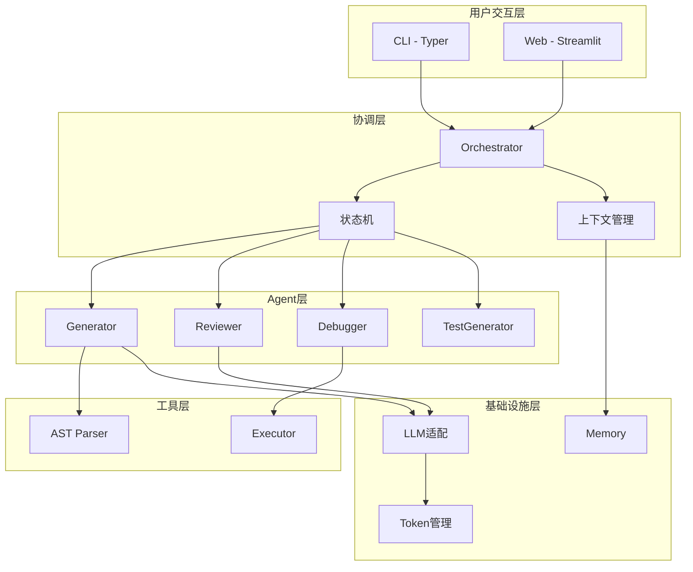
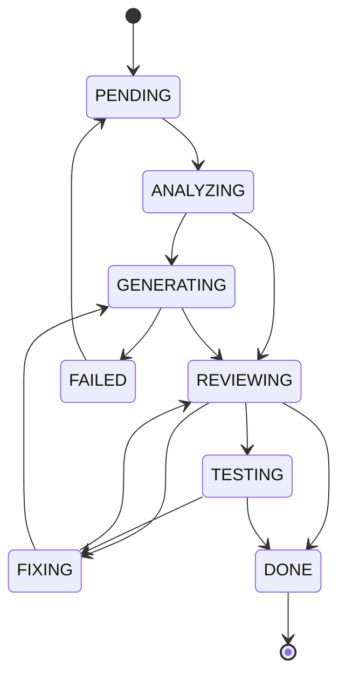

# CodeCraft Agent 简历展示完善方案

> 创建时间: 2026-04-12
> 目标: 完善项目以提升简历展示效果

> ⚠️ **本方案已作废（2026-09-10 标注）**: 本文是 2026-04-12 的「简历展示完善」方案，其中三项最终未落地，阅读时请勿当作现状：
> - **记忆系统 / ChromaDB 向量检索** —— 曾按本方案实现，但实现后从未被主流程调用，已于 2026-09-10 整体删除；
> - **在线 Demo** —— 从未实际部署，下文的 `codecraft-agent.streamlit.app` 只是方案里的占位地址，**不是可用链接**；
> - **测试数据** —— 文中「67个测试 / 81%覆盖率」为当时口径，当前为 **118 个测试、backend 覆盖率约 74%**。
>
> 最新状态请见 [PROGRESS.md](PROGRESS.md)、[HIGHLIGHTS.md](HIGHLIGHTS.md)。

---

## 一、项目现状分析

### 已完成内容

| 模块 | 完成度 | 关键文件 |
|------|--------|----------|
| 核心框架 | 100% | `backend/core/` - Agent基类、Orchestrator、状态机、协议 |
| Agent实现 | 100% | `backend/agents/` - Generator、Reviewer、Debugger、TestGenerator |
| LLM抽象层 | 100% | `backend/llm/` - OpenAI、Claude适配，Token管理器 |
| 工具层 | 100% | `backend/tools/` - AST解析器、代码执行器 |
| CLI界面 | 100% | `cli/main.py` - Typer命令行 |
| Web界面 | 100% | `frontend/` - Streamlit应用 |
| 测试 | 100% | `tests/` - 67个测试，81%覆盖率 |

### 待完善内容

| 方向 | 当前状态 | 差距 |
|------|----------|------|
| 架构图可视化 | 仅有文本描述 | 缺少可视化图表 |
| Demo演示脚本 | 无专门demo | 缺少惊艳案例 |
| 流式输出 | LLM支持stream | UI未实现流式展示 |
| 记忆系统 | 简单ShortTermMemory | 未实现ChromaDB向量存储 |
| 在线Demo | 本地运行 | 未部署Streamlit Cloud |
| 项目亮点文档 | 分散在README | 缺少面试话术汇总 |

---

## 二、任务实施方案

### 任务1: 架构图可视化

**目标**: 在README中添加清晰、专业的架构图

**做什么**:
1. 创建系统架构图（Mermaid格式）
2. 创建Agent协作流程图
3. 创建状态机转换图

**产出物**:
- `docs/assets/architecture.svg` - 系统架构图
- `docs/assets/workflow.svg` - Agent协作流程图
- `docs/assets/state-machine.svg` - 状态机转换图

**Mermaid示例**:



**状态机转换图**:


**预计工作量**: 2-3小时
**优先级**: P0

---

### 任务2: Demo演示脚本

**目标**: 准备惊艳的演示案例，展示核心能力

**做什么**:
1. 创建 `demos/` 目录
2. 准备3-5个典型场景的演示脚本
3. 制作演示指南

**产出物结构**:
```
demos/
├── demo_quick_sort.py        # 排序算法生成演示
├── demo_security_fix.py      # 安全问题修复演示
├── demo_performance.py       # 性能优化演示
├── demo_full_workflow.py     # 完整工作流演示
├── run_all_demos.py          # 一键运行所有demo
└── DEMO_GUIDE.md             # 演示指南
```

**演示案例设计**:

**案例1: 排序算法生成**
```python
"""
演示场景: 生成快速排序算法
展示能力: 代码生成、PEP8规范、类型注解
"""
requirement = "实现一个快速排序算法，支持自定义比较函数"
```

**案例2: 安全漏洞修复**
```python
"""
演示场景: SQL注入漏洞修复
展示能力: 代码审查发现问题、自动修复安全漏洞
"""
vulnerable_code = '''
def get_user(cursor, user_id):
    query = f"SELECT * FROM users WHERE id = {user_id}"
    cursor.execute(query)
    return cursor.fetchone()
'''
# 预期: Reviewer发现SQL注入风险 → Debugger修复为参数化查询
```

**案例3: 性能优化**
```python
"""
演示场景: O(n^2) → O(n) 复杂度优化
展示能力: 性能问题检测、优化建议生成
"""
slow_code = '''
def find_duplicates(arr):
    duplicates = []
    for i in range(len(arr)):
        for j in range(i+1, len(arr)):
            if arr[i] == arr[j] and arr[i] not in duplicates:
                duplicates.append(arr[i])
    return duplicates
'''
# 预期: 建议使用set优化为O(n)
```

**预计工作量**: 4-5小时
**优先级**: P0

---

### 任务3: 流式输出

**目标**: Web UI实时显示代码生成过程，增强交互体验

**做什么**:
1. 修改 `chat.py` 支持流式显示
2. 优化Agent状态组件，添加动态效果
3. 实现代码逐字输出效果

**修改文件**: `frontend/pages/chat.py`

**核心实现**:
```python
import streamlit as st
from typing import Iterator

def render_streaming_code(llm, messages, placeholder):
    """流式渲染代码生成"""
    full_response = ""
    for chunk in llm.stream(messages):
        full_response += chunk
        placeholder.code(full_response, language="python")
    return full_response

# 在chat.py中使用
with st.spinner("正在生成代码..."):
    code_placeholder = st.empty()
    code = render_streaming_code(llm, messages, code_placeholder)
```

**产出物**:
- `frontend/pages/chat.py` (修改)
- `frontend/components/streaming_display.py` (新增)

**预计工作量**: 3-4小时
**优先级**: P1

---

### 任务4: 记忆系统增强（ChromaDB）

**目标**: 实现基于ChromaDB的向量记忆，体现RAG能力

**做什么**:
1. 实现 `VectorMemory` 类
2. 添加代码片段向量化存储
3. 实现相似代码检索功能
4. 更新Web UI展示记忆功能

**新增文件**: `backend/core/vector_memory.py`

```python
"""向量记忆系统模块"""

import chromadb
from chromadb.config import Settings
from typing import Any, Optional
from datetime import datetime

class VectorMemory:
    """基于ChromaDB的向量记忆系统"""

    def __init__(self, persist_dir: str = "./memory/chroma"):
        self.client = chromadb.PersistentClient(path=persist_dir)
        self.collection = self.client.get_or_create_collection(
            name="code_memory",
            metadata={"description": "Code generation history"}
        )

    def add(self, requirement: str, code: str, metadata: dict = None):
        """添加代码记忆"""
        doc_id = f"doc_{datetime.now().strftime('%Y%m%d_%H%M%S')}"
        self.collection.add(
            documents=[f"需求: {requirement}\n代码: {code}"],
            metadatas=[metadata or {}],
            ids=[doc_id]
        )

    def search(self, query: str, n_results: int = 5) -> list[dict]:
        """相似代码检索"""
        results = self.collection.query(
            query_texts=[query],
            n_results=n_results
        )
        return results
```

**产出物**:
- `backend/core/vector_memory.py` (新增)
- `backend/core/memory.py` (修改)
- `frontend/pages/memory.py` (新增)
- `tests/test_vector_memory.py` (新增)

**预计工作量**: 4-6小时
**优先级**: P1

---

### 任务5: 在线Demo部署

**目标**: 部署到Streamlit Cloud，提供在线访问

**做什么**:
1. 创建部署配置文件
2. 适配云端运行环境
3. 添加API Key安全配置

**新增文件**:

1. `.streamlit/config.toml`:
```toml
[server]
port = 8501
enableCORS = false
enableXsrfProtection = true

[theme]
primaryColor = "#4F46E5"
backgroundColor = "#FFFFFF"
secondaryBackgroundColor = "#F3F4F6"
textColor = "#1F2937"
```

2. `.streamlit/secrets.toml.example`:
```toml
# 复制为 secrets.toml 并填入API Key
DEEPSEEK_API_KEY = "your-key-here"
```

**部署步骤**:
```bash
# 1. 推送代码到GitHub
git push origin main

# 2. 访问 share.streamlit.io
# 3. 连接GitHub仓库
# 4. 选择 frontend/app.py 作为入口
# 5. 在Secrets中配置API Key
# 6. 部署完成
```

**产出物**:
- `.streamlit/config.toml` (新增)
- `.streamlit/secrets.toml.example` (新增)
- `frontend/app.py` (修改，支持secrets)
- 部署URL: `https://codecraft-agent.streamlit.app`

**预计工作量**: 1-2小时
**优先级**: P1

---

### 任务6: 项目亮点文档

**目标**: 汇总面试话术、技术亮点，便于面试展示

**做什么**:
1. 创建 `HIGHLIGHTS.md` 面试亮点文档
2. 创建 `INTERVIEW_GUIDE.md` 面试话术
3. 更新README添加亮点标签

**产出物1**: `HIGHLIGHTS.md`

```markdown
# CodeCraft Agent 项目亮点

## 技术亮点

### 1. 多Agent协作架构
- **设计模式**: Orchestrator模式，集中式协调
- **Agent通信**: 定义消息协议，支持任务分配、结果返回、反馈闭环
- **状态管理**: 有限状态机(FSM)，确保任务流转可控

### 2. 反馈闭环机制
Generator → Reviewer → [通过] → Done
                 ↓ [不通过]
             Debugger → Reviewer (重审)

- 最大迭代次数控制，避免无限循环
- 问题分级处理

### 3. LLM抽象层
- 工厂模式创建不同Provider
- 统一接口，易于扩展新模型
- 支持OpenAI/Claude/DeepSeek

### 4. 工具链设计
- AST解析器：代码结构分析
- 沙箱执行器：安全代码运行
- Token管理器：上下文窗口优化

### 5. 记忆系统
- 短期记忆：会话级存储
- 向量记忆：ChromaDB语义检索

## 代码质量指标
- 测试覆盖率: 81%
- 测试数量: 67个
- 代码行数: ~3000行
- 模块化程度: 高

## 可展示的技术能力
- Python高级编程（类型注解、装饰器、异步）
- 设计模式应用（工厂、状态机、策略模式）
- LLM应用开发（LangChain）
- Web开发（Streamlit）
- 测试驱动开发（TDD）
```

**产出物2**: `INTERVIEW_GUIDE.md`

```markdown
# 面试展示指南

## 开场介绍（30秒）
"我开发了一个多Agent协作的代码生成助手，核心价值是..."

## 架构展示（2分钟）
1. 展示架构图
2. 讲解分层设计
3. 说明为什么这样设计

## 核心问题回答模板

### Q: 为什么用多Agent而不是单Agent？
A:
- 职责分离，每个Agent专注一个任务
- 便于测试和维护
- 可独立优化每个Agent的Prompt
- 体现模块化设计思想

### Q: 状态机有什么好处？
A:
- 任务状态可追踪
- 防止非法状态转换
- 便于调试和监控
- 支持断点续传

### Q: 如何处理LLM的不稳定性？
A:
- 多轮审查机制
- 结构化输出要求（JSON格式）
- 错误重试策略
- 人工反馈闭环

### Q: 这个项目的难点是什么？
A:
- Agent间协调的复杂性
- 状态转换的边界条件
- Token管理优化
- 代码执行的安全性

## 演示流程
1. CLI演示（1分钟）
2. Web UI演示（2分钟）
3. 架构讲解（2分钟）
4. Q&A

## 简历写法建议

> ⚠️ **下面这句原文已失实**（"集成ChromaDB向量检索"对应的模块已删除、"81%"口径过期），**不得直接使用**。修正版见其后。

~~设计并实现多Agent协作的Python代码生成系统，采用Orchestrator模式协调4个专业Agent（生成、审查、调试、测试），通过状态机管理任务流转，实现了代码生成-审查-修复的自动化闭环。支持OpenAI/Claude多模型切换，集成ChromaDB向量检索，测试覆盖率81%。~~

**修正版（2026-09-10 核实）**:
> 设计并实现多Agent协作的Python代码生成系统，采用Orchestrator模式协调4个专业Agent（生成、审查、调试、测试），通过8状态有限状态机管理任务流转，实现了代码生成-审查-修复-测试的自动化闭环。支持OpenAI/Claude多模型切换，118个测试全部通过。

```

**产出物3**: 更新README添加徽章

```markdown
# CodeCraft Agent


   <!-- ⚠️ 旧值，勿直接使用；当前为 118 -->
          <!-- ⚠️ 旧值，勿直接使用；当前 backend 约 74% -->


> 多Agent协作的Python代码生成与优化助手 | [在线Demo](https://codecraft-agent.streamlit.app)

## 项目亮点

| 特性 | 描述 |
|------|------|
| 多Agent协作 | Generator → Reviewer → Debugger → TestGenerator |
| 状态机管理 | 7状态有限状态机，确保任务流转可控 |
| 反馈闭环 | 审查不通过自动修复，最多3次迭代 |
| 多模型支持 | OpenAI / Claude / DeepSeek 可切换 |
| 向量记忆 | ChromaDB语义检索历史代码 |
```

**预计工作量**: 2-3小时
**优先级**: P0

---

## 三、任务依赖关系与执行顺序

```
Phase A: 基础完善（可并行）
├── 任务1: 架构图可视化 ─────────┐
├── 任务6: 项目亮点文档 ─────────┤
│                                ↓
Phase B: 功能增强               ├──→ 任务2: Demo演示脚本
├── 任务3: 流式输出 ─────────────┤
├── 任务4: 记忆系统 ─────────────┘
│
Phase C: 部署上线
└── 任务5: 在线Demo部署（依赖任务3、4完成）
```

**推荐执行顺序**:

| 阶段 | 任务 | 预计时间 | 原因 |
|------|------|----------|------|
| Day 1-2 | 任务1 架构图 | 3h | 文档基础，其他任务依赖 |
| Day 1-2 | 任务6 亮点文档 | 3h | 可与任务1并行 |
| Day 3-4 | 任务3 流式输出 | 4h | 提升演示效果 |
| Day 3-5 | 任务4 记忆系统 | 6h | 体现技术深度 |
| Day 4-5 | 任务2 Demo脚本 | 5h | 依赖架构图完成 |
| Day 6 | 任务5 部署 | 2h | 最后一步 |

---

## 四、工作量与优先级汇总

| 任务 | 优先级 | 工作量 | 价值 | 建议顺序 |
|------|--------|--------|------|----------|
| 1. 架构图可视化 | P0 | 3h | 面试必备 | 1 |
| 6. 项目亮点文档 | P0 | 3h | 面试必备 | 2 |
| 2. Demo演示脚本 | P0 | 5h | 展示效果好 | 3 |
| 3. 流式输出 | P1 | 4h | 体验提升 | 4 |
| 4. 记忆系统 | P1 | 6h | 技术深度 | 5 |
| 5. 在线Demo部署 | P1 | 2h | 便于分享 | 6 |

**总工作量**: 约 23 小时（3-4天）

---

## 五、技术要点与注意事项

### 架构图注意事项
- 保持图表风格统一
- 使用中文标注
- 导出多种格式（SVG用于README，PNG用于PPT）

### 流式输出注意事项
- Streamlit的 `st.empty()` 是关键
- 处理网络异常，提供重试机制
- 大模型输出可能被截断，需要缓冲处理

### ChromaDB注意事项
- Windows路径问题：使用 `os.path.join`
- 首次运行需要下载embedding模型
- 持久化目录需加入 `.gitignore`

### 部署注意事项
- Streamlit Cloud有冷启动时间
- API Key必须通过Secrets配置
- 添加访问限制说明（Demo版本）

---

## 六、验收标准

| 任务 | 验收标准 |
|------|----------|
| 架构图 | README中清晰展示系统架构，GitHub正确渲染 |
| Demo脚本 | 运行 `python demos/run_all_demos.py` 可完整演示 |
| 流式输出 | Web UI代码生成时逐字显示 |
| 记忆系统 | 可搜索历史代码，返回相似结果 |
| 在线部署 | 访问URL可正常使用 |
| 亮点文档 | 面试官看完能在1分钟内理解项目价值 |

---

## 七、关键文件清单

| 文件 | 用途 |
|------|------|
| `README.md` | 添加架构图、徽章、亮点 |
| `frontend/pages/chat.py` | 流式输出实现 |
| `backend/core/memory.py` | ChromaDB集成 |
| `frontend/app.py` | Streamlit Cloud适配 |
| `demos/` (新建) | 演示脚本目录 |
| `HIGHLIGHTS.md` | 技术亮点文档 |
| `INTERVIEW_GUIDE.md` | 面试话术文档 |
