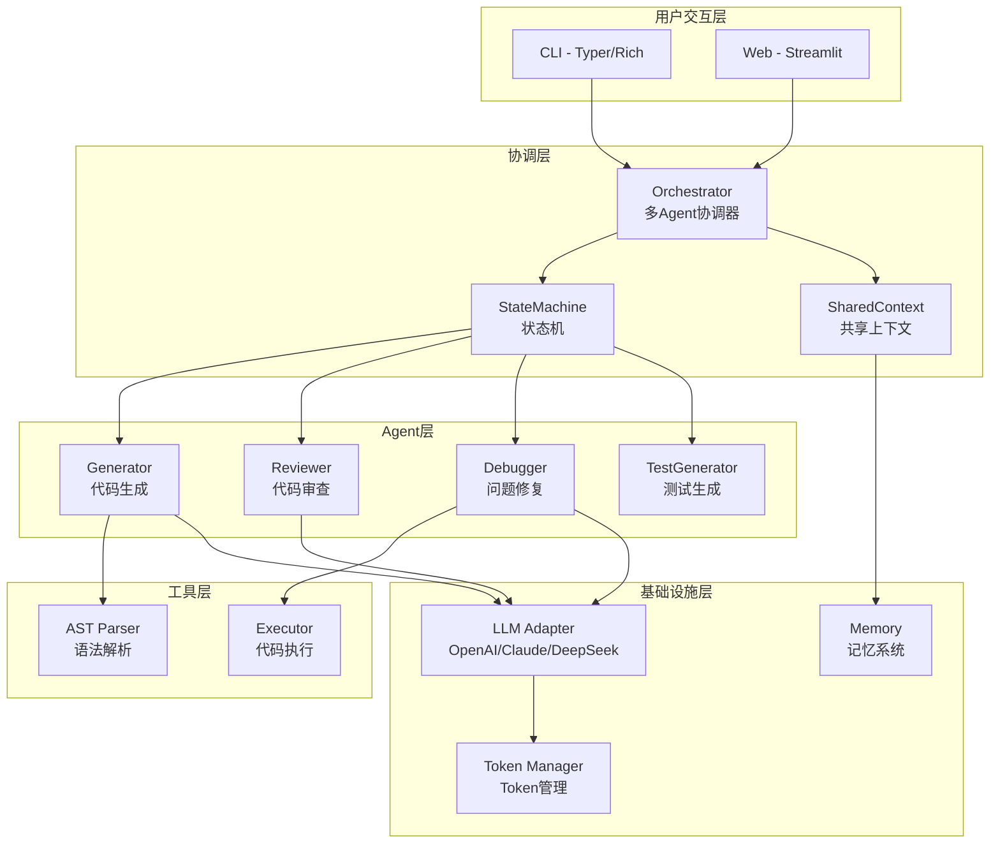
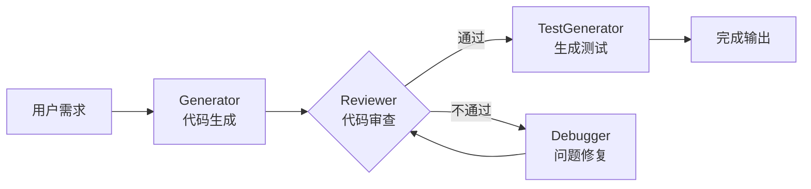
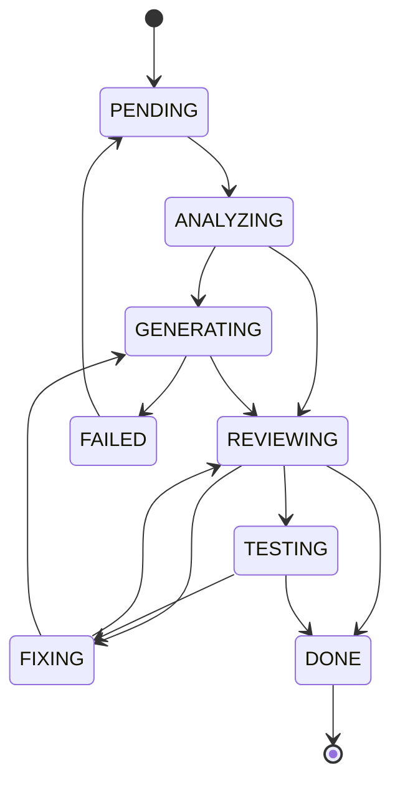

# CodeCraft Agent


> 多Agent协作的Python代码生成与优化助手

基于多Agent协作的Python代码生成与优化助手，实现代码生成 → 审查 → 修复 → 测试的完整闭环。

📚 **文档**: [项目亮点](HIGHLIGHTS.md) | [面试指南](INTERVIEW_GUIDE.md) | [详细架构](docs/assets/architecture.md)

## 项目亮点

| 特性 | 描述 |
|------|------|
| 🤖 多Agent协作 | Generator → Reviewer → Debugger → TestGenerator |
| 🔄 反馈闭环 | 审查不通过自动修复，最多3次迭代 |
| 📊 状态机管理 | 8状态有限状态机，确保任务流转可控 |
| 🔌 多模型支持 | OpenAI / Claude / DeepSeek 可切换 |
| 🧠 向量记忆 | ChromaDB语义检索历史代码 |
| ✅ 高测试覆盖 | 67个测试用例，81%覆盖率 |

## 功能特性

- **智能代码生成** - 根据自然语言需求生成符合PEP 8规范的Python代码
- **自动代码审查** - 多维度审查代码质量（规范、Bug、性能、安全、可维护性）
- **问题自动修复** - 分析审查结果并自动修复代码问题
- **测试用例生成** - 为代码自动生成pytest测试用例
- **多Agent协作** - 生成 → 审查 → 修复 → 测试的完整闭环
- **历史记录管理** - 保存和管理代码生成历史

## 技术栈

| 类别 | 技术 |
|------|------|
| 语言 | Python 3.10+ |
| LLM框架 | LangChain |
| LLM API | OpenAI / Claude / DeepSeek |
| CLI框架 | Typer + Rich |
| Web框架 | Streamlit |
| 向量存储 | ChromaDB |
| 测试框架 | Pytest (67个测试, 81%覆盖率) |

## 项目结构

```
CodeCraft Agent/
├── backend/                    # 后端核心模块
│   ├── core/                   # 核心框架
│   │   ├── agent.py            # Agent基类
│   │   ├── orchestrator.py     # 多Agent协调器
│   │   ├── state.py            # 任务状态机
│   │   ├── protocol.py         # Agent通信协议
│   │   ├── context.py          # 共享上下文
│   │   ├── memory.py           # 记忆系统
│   │   ├── logger.py           # 日志系统
│   │   └── errors.py           # 统一错误处理
│   ├── agents/                 # 专业Agent实现
│   │   ├── code_generator.py   # 代码生成Agent
│   │   ├── code_reviewer.py    # 代码审查Agent
│   │   ├── debugger.py         # 调试Agent
│   │   └── test_generator.py   # 测试生成Agent
│   ├── tools/                  # 工具层
│   │   ├── ast_parser.py       # AST解析器
│   │   └── executor.py         # 代码执行器
│   ├── llm/                    # LLM抽象层
│   │   ├── base.py             # LLM抽象基类
│   │   ├── openai_llm.py       # OpenAI实现
│   │   ├── claude_llm.py       # Claude实现
│   │   └── token_manager.py    # Token管理器
│   └── utils/                  # 工具模块
│       └── code_utils.py       # 代码处理工具
├── frontend/                   # Streamlit Web界面
│   ├── app.py                  # 主入口
│   ├── components/             # UI组件
│   └── pages/                  # 页面
├── cli/                        # 命令行界面
│   └── main.py                 # CLI入口
├── tests/                      # 测试文件
├── docs/                       # 文档
├── run_web.bat                 # Windows启动脚本
└── pyproject.toml              # 项目配置
```

## 快速开始

### 安装

```bash
# 克隆项目
git clone <repository-url>
cd "CodeCraft Agent"

# 安装依赖
pip install -r requirements.txt

# 安装项目
pip install -e ".[dev]"
```

### 配置 API Key

```bash
# 方式一：环境变量
export OPENAI_API_KEY="your-api-key"
# 或
export DEEPSEEK_API_KEY="your-api-key"
# 或
export ANTHROPIC_API_KEY="your-api-key"

# 方式二：配置文件 (~/.codecraft/config.json)
```

### 启动 Web UI

```bash
# Windows
run_web.bat

# Linux/Mac
./run_web.sh

# 或直接运行
streamlit run frontend/app.py --server.port 8501
```

访问 `http://localhost:8501`

### 使用 CLI

```bash
# 生成代码
python -m cli.main generate "实现一个快速排序算法"

# 快速模式（跳过审查）
python -m cli.main generate "实现一个快速排序算法" --fast

# 交互模式
python -m cli.main chat

# 查看版本
python -m cli.main version
```

## 架构设计

### 系统架构图



### Agent协作流程



### 状态机转换



### 核心特性

- **ReAct推理模式** - 观察-思考-行动循环决策
- **状态机管理** - PENDING → ANALYZING → GENERATING → REVIEWING → FIXING → TESTING → DONE
- **反馈闭环** - 审查不通过自动修复，修复后重新审查

> 📄 详细架构图请查看 [docs/assets/architecture.md](docs/assets/architecture.md)

## 开发

### 运行测试

```bash
# 运行所有测试
pytest tests/ -v

# 带覆盖率
pytest tests/ --cov=backend --cov-report=html
```

### 代码质量

```bash
# Linting
ruff check backend/

# 类型检查
mypy backend/
```

## 许可证

MIT License
