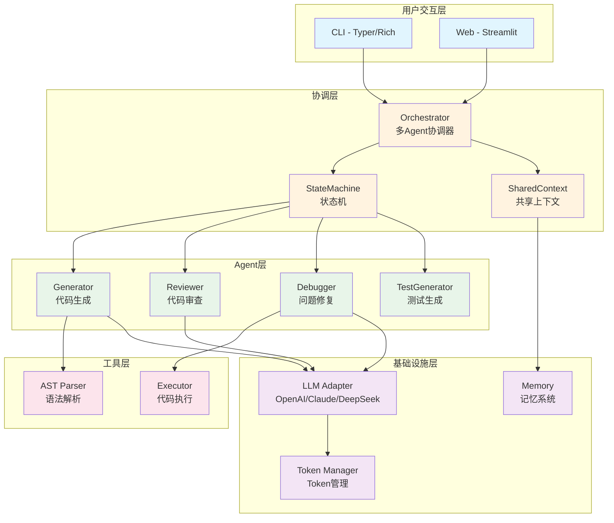
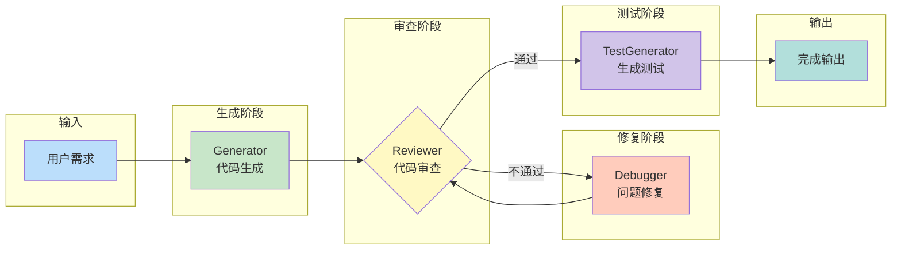
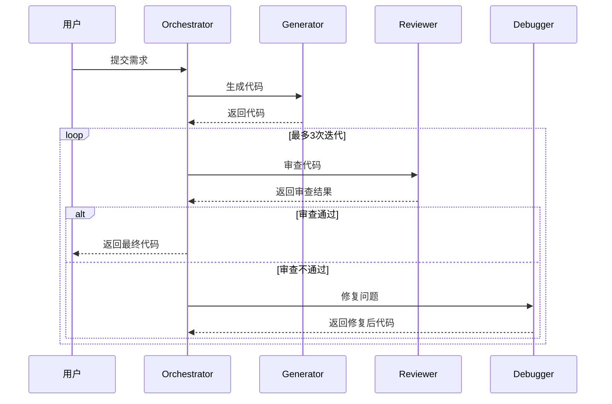
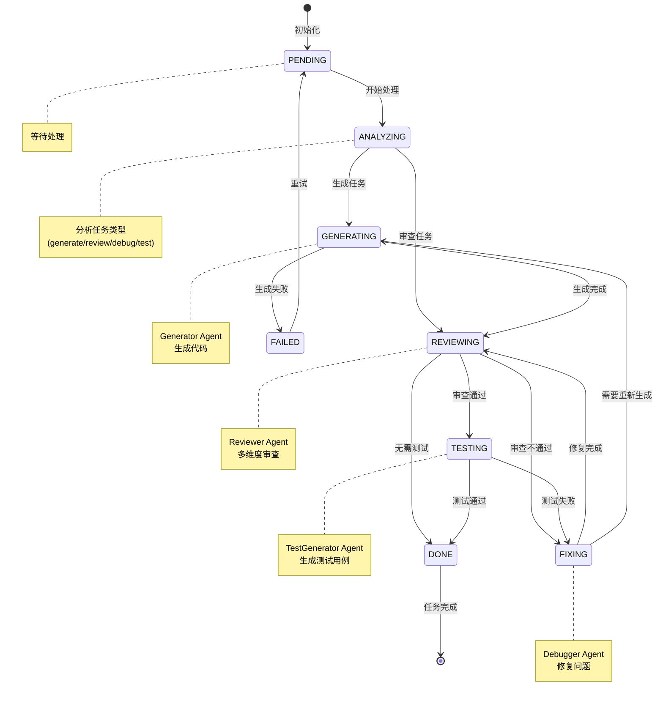
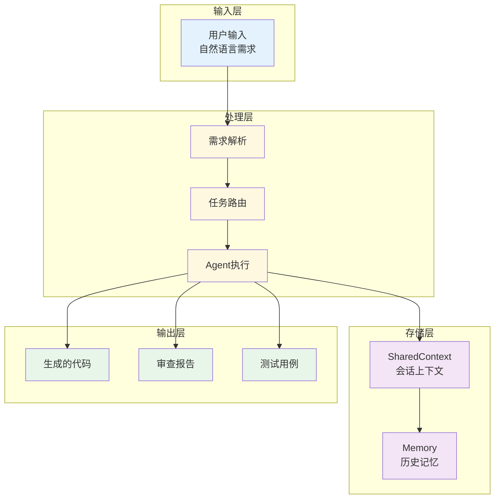
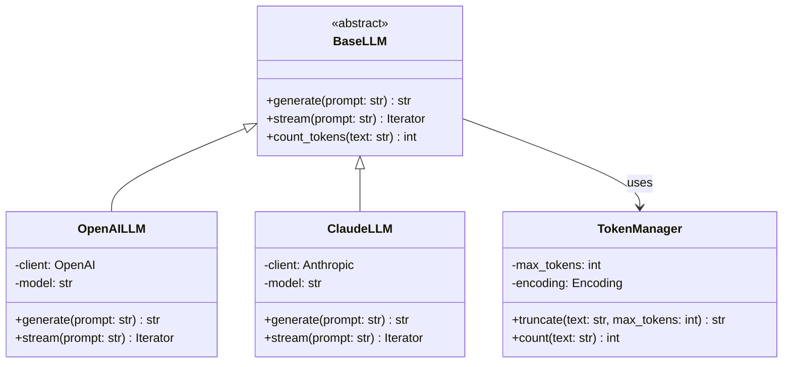

# CodeCraft Agent 架构图

> 本文档包含项目的核心架构图，使用 Mermaid 格式，可在 GitHub 和支持 Mermaid 的 Markdown 编辑器中渲染。

---

## 1. 系统架构图

---

## 2. Agent协作流程图

### 反馈闭环机制

---

## 3. 状态机转换图

### 状态说明

| 状态 | 说明 | 可转换状态 |
|------|------|------------|
| PENDING | 等待处理 | ANALYZING |
| ANALYZING | 分析任务类型 | GENERATING, REVIEWING |
| GENERATING | 代码生成中 | REVIEWING, FAILED |
| REVIEWING | 代码审查中 | TESTING, FIXING, DONE |
| FIXING | 问题修复中 | REVIEWING, GENERATING |
| TESTING | 测试生成中 | DONE, FIXING |
| DONE | 任务完成 | - |
| FAILED | 任务失败 | PENDING |

---

## 4. 数据流图

---

## 5. LLM抽象层架构

---

## 渲染说明

- 以上图表使用 **Mermaid** 语法编写
- GitHub 原生支持 Mermaid 渲染
- VS Code 可安装 "Markdown Preview Mermaid Support" 插件预览
- 在线预览: [Mermaid Live Editor](https://mermaid.live/)
